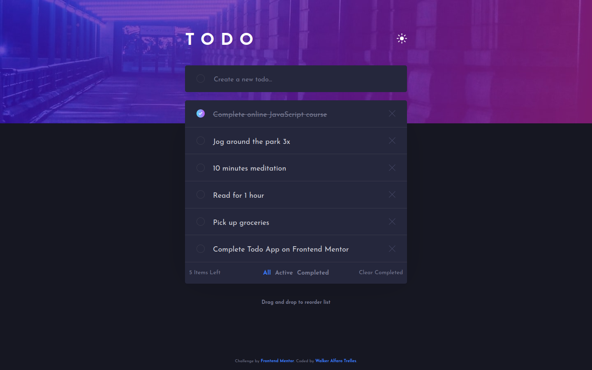
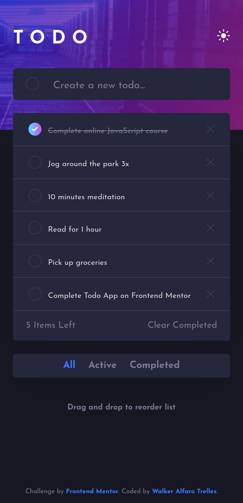
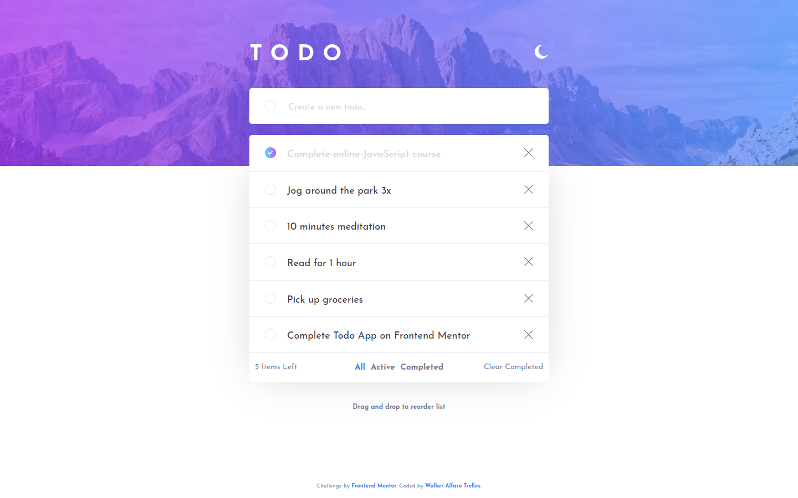
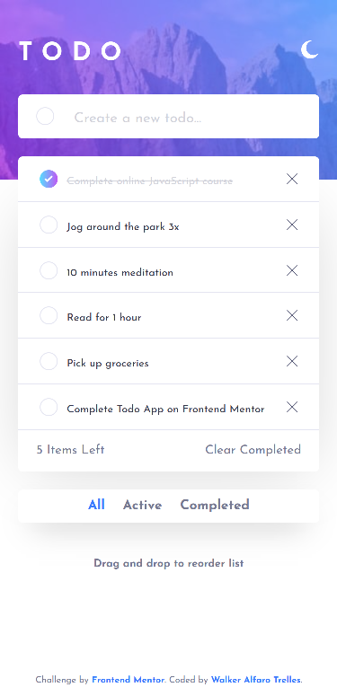

# Frontend Mentor - Todo app solution

This is a solution to the [Todo app challenge on Frontend Mentor](https://www.frontendmentor.io/challenges/todo-app-Su1_KokOW) provided by [Walker Alfaro Trelles](https://www.frontendmentor.io/profile/WalkerAlfaro) :robot:

## Table of contents

- [Frontend Mentor - Todo app solution](#frontend-mentor---todo-app-solution)
  - [Table of contents](#table-of-contents)
  - [Overview](#overview)
    - [The challenge](#the-challenge)
    - [Screenshot](#screenshot)
    - [Links](#links)
  - [My process](#my-process)
    - [Built with](#built-with)
    - [What I learned](#what-i-learned)
    - [Continued development](#continued-development)
    - [Useful resources](#useful-resources)
  - [Author](#author)
  - [Acknowledgments](#acknowledgments)

## Overview

### The challenge

Users should be able to:

- View the optimal layout for the app depending on their device's screen size
- See hover states for all interactive elements on the page
- Add new todos to the list
- Mark todos as complete
- Delete todos from the list
- Filter by all/active/complete todos
- Clear all completed todos
- Toggle light and dark mode
- **Bonus**: Drag and drop to reorder items on the list

### Screenshot

The challenge required to have a dark version for both screen size, mobile and desktop






### Links

- Solution URL: [Github](https://github.com/WalkerAlfaro/FrontendMentor_Todo_App)
- Live Site URL: [Netlify](https://walker-alfaro-todo-app.netlify.app)

## My process

### Built with

- [React](https://reactjs.org/) - JS library
- [Clsx](https://yarnpkg.com/package/clsx) - constructing className strings conditionally
- [@hello-pangea/dnd](https://github.com/hello-pangea/dnd) - Drag and Drop library
- [Sass](https://sass-lang.com/) - CSS with superpowers
- [ViteJs](https://vitejs.dev/) - Light local server
- Mobile-first workflow

### What I learned

- Plan the development of an app more efficiently, since these challenges are ideal for developing many areas, practicing and learning.
- Use the [Context Hook](https://reactjs.org/docs/context.html), in my case to create a global state throughout the app so that all components have the same **theme** (light or dark).
- Use [@hello-pangea/dnd](https://github.com/hello-pangea/dnd) library to order tasks by simply dragging and dropping them.
- Combine CSS modules with SASS, having the advantages of Sass as *mixins*, *nesting* mixed with the advantages of React style modules.
- Utilizar la libreria **clsx** que permite el uso condicional de clases, sobretodo cuando se trata de estilos modulares. Por ejemplo:
  
```js
  const todo_container = clsx({
    [styles.todo_container_light]: true,
    [styles.todo_container_dark]: (themeContext.theme === 'dark'),
  })
```
>*In this example, the **todo_container_light** class is always called, and when the condition that the theme is dark the **todo_container_dark** class is additionally applied.*

### Continued development

There are definitely many areas for improvement, like modularity of styles, learning to use other Hooks, maybe using other drag and drop libraries like [SortableJS](https://github.com/SortableJS) their version for React.

### Useful resources

- [Using Inner reference](https://github.com/hello-pangea/dnd/blob/main/docs/guides/using-inner-ref.md) - This guide from **@hello-pangea** helped me understand how to define the reference in functional components.

## Author

- Frontend Mentor - [@walkeralfaro](https://www.frontendmentor.io/profile/WalkerAlfaro)

## Acknowledgments

The styles were the most difficult to implement. The logic of operation with functional components is not that complicated with React. Many times it is underestimated how complicated styling can be, so I recommend using a CSS preprocessor like Sass (in my case).

In the case of using React or Vue, I recommend defining the components and their iterations to provide the simplest and most reusable solution.

I share the way in which I have defined each section visually to define styles, but not interactions:

